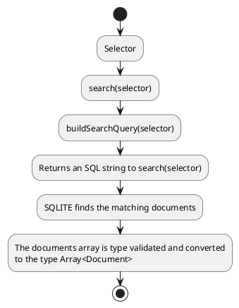
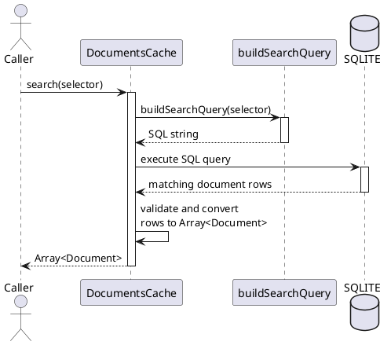

A document group is, well, a group of documents, selected by a flexible mechanism giving several angles of selecting documents.

It allows a plugin author, or site author, to select documents by various attributes, using them for a desired purpose.

For example, `@akashacms/plugins-blog-podcast` plugin declares that a subset of the documents on a site are a "_blog_".  It supports there being multiple blogs with the "_blogtag_" frontmatter item.  The site administrator uses a selector to declare which documents are part of a given blog, how to sort the documents, and more.

A _document group_ is an array of AkashaCMS documents defined by a _selector_.

The selector describes the attributes controlling which documents are members of the document group.

There are four ways to select a document group.

## Document groups selected by `akasharender search`

The `akasharender search` command uses command-line options to describe the selector:

```shell
$ npx akasharender search config-normal.mjs  --help
Usage: akasharender search [options] <configFN>

Search for documents

Options:
  --root <rootPath>                Select only files within the named directory
  --match <pathmatch>              Select only files matching the regular expression
  --rendermatch <renderpathmatch>  Select only files matching the regular expression
  --glob <globmatch>               Select only files matching the glob expression
  --renderglob <globmatch>         Select only files rendering to the glob expression
  --parentDir <path>               Select only files whose parent directory is the named directory
  --dirname <path>                 Select only files within the named directory
  --skipglob <globmatch>           Skip files matching the glob expression
  --layouts <layouts...>           Select only files matching the layouts
  --mime <mime>                    Select only files matching the MIME type
  --tags <tags...>                 Select only files with the tags
  --blogtags <blogtags...>         Select only files with the blogtags
  --limit <limit>                  Return only so many items
  --offset <offset>                Return only items starting from the offset within the result set
  --sort-by <field>                Sort results by a document column or frontmatter field
  --sort <direction>               Sort direction, either "asc" or "desc"
  -h, --help                       display help for command
```

The documents are listed in YAML format on stdout.

This is primarily meant for exploration, so that you can verify how the parameters affect which documents are in a group.

## Document groups selected with the `<document-group>` tag

The `<document-group>` tag is part of the _built-in_ plugin, meaning it is always available and there is no configuration required.

Its complete documentation is in the documentation at: https://akashacms.com/plugins/built-in/index.html

The shape for the tag is:

```html
<document-group id="..." class="..." style="..."
    root-path="..."
    renders-to-html="..."
    vpath-glob="..."
    render-glob="..."
    layout="..."
    blogtag="..."
    tag="..."
    parent-dir="..."
    dirname="..."
    skip-glob="..."
    limit="..."
    offset="..."
    sort-by="..."
    sort="..."
    template="..."></document-group>
```

Most of these attributes correspond to the `akasharender search` command and are what describes the selector.

This tag is placed either in a template, or in a document.

The `template=` attribute names a partial template that is used to format documents in the group.

In other words, this is useful for creating a list of documents, with consistent formatting of each entry in the group.

## The `DocumentsCache.search(selector)` API

Both of those methods create a _selector_ object to pass to the `search(selector)` method.

This method converts the selector into an SQL statement, searches the documnet table for matching documents, applies sorting, limit, and offset parameters, and returns the resulting documents.

Calling `search(selector)` results in an array of Document objects.

The internal workflow is:



The same process, viewed as the interactions between the caller, the
`DocumentsCache`, the query builder, and the SQLITE database, is:



### Selecting a subset of fields to return

By default, the `search(selector)` function returns Document objects.

It's excess overhead to return the full Document object if the application wants only a couple of fields.  For this purpose add this to the selector:

```js
selector.return_fields = [
   'vpath', 'renderPath', 'title'
];
```

This works by modifying the SELECT statement from:

```sql
SELECT d.* FROM table ...
```

To this:

```sql
SELECT field1, field2, field3 FROM table ...
```

The array `return_fields` must therefore be SQL field selectors.

## The `@akashacms/plugins-blog-podcast` blog selector

In the `@akashacms/plugins-blog-podcast`, we define one or more blogs on an AkashaCMS project.  Recall that a _blog_ is simply a group of postings (aka documents) that are part of the blog, which are presented in reverse-chronological order, and where an RSS feed is available.

The documents that are part of a given blog are a document group.

The blog configuration object includes a field, `matchers`, which is a selector suitable for `search(selector)`.  Under the covers `search(selector)` is called whenever the plugin needs the list of documents that are part of the blog.

This `matchers` object predated the `search(selector)` object, hence the naming difference.  As the two objects serve the same purpose, they were harmonized in the `0.10` time-frame to have the same selector fields.

For example, the _News_ blog on https://akashacms.com has this blog selector:

```js
news: {
    rss: {
        title: "AkashaCMS News",
        description: "Announcements and news about the AkashaCMS content management system",
        site_url: "http://akashacms.com/news/index.html",
        image_url: "http://akashacms.com/logo.gif",
        managingEditor: 'David Herron',
        webMaster: 'David Herron',
        copyright: '2015 David Herron',
        language: 'en',
        categories: [ "Node.js", "Content Management System", "HTML5", "Static website generator" ]
    },
    rssurl: "/news/rss.xml",
    matchers: {
        layouts: [ "blog.html.ejs", "blog.html.liquid", "blog.html.njk" ],
        rootPath: 'news/'
    }
},
```

The `rss` and `rssurl` fields determine the characteristics of the RSS feed for the blog.

The `matchers` field is the `search(selector)` with some additional values supported by the plugin.  Those values are for backwards compatibility, and are converted into `search(selector)` values.

The _blogtag_ in this case is `news`, making it the News blog.

