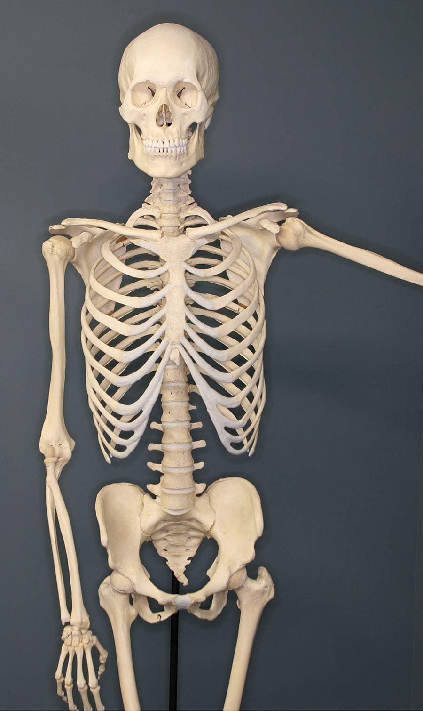

THIS IS THE OVERRIDING VERSION OF img2resize

This image should be left alone

This image should be resized to 150px, to a new file name, and `` attribute rewritten

This image should be encased in a `<figure>`, with a `<figcaption>`, resized to 150px, and new file name

This tests resizing an image from a mounted directory

This tests resizing an image from a mounted directory

